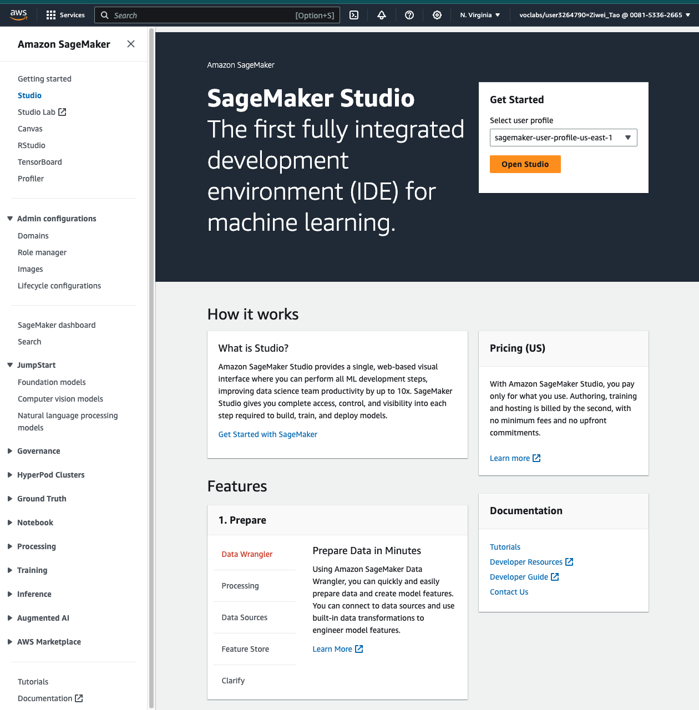

# This project contains all labs from this course on Coursera: Generative AI with Large Language Models. 
- Lab1: Generative AI Use Case: Summarize Dialogue
- Lab2: Fine-tune a generative AI model for dialogue
- Lab3: Fine-tune FLAN-T5 With reinforcement learning to generate more-positive summaries
## All labs were running on the Amazon SageMaker, as shown in the following figure.
The web address likes this: https://us-east-1.console.aws.amazon.com/sagemaker/home?region=us-east-1#/studio-landing \
\

